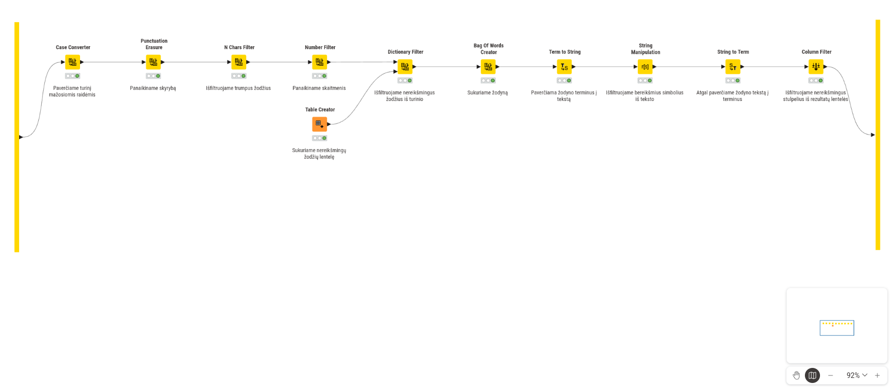
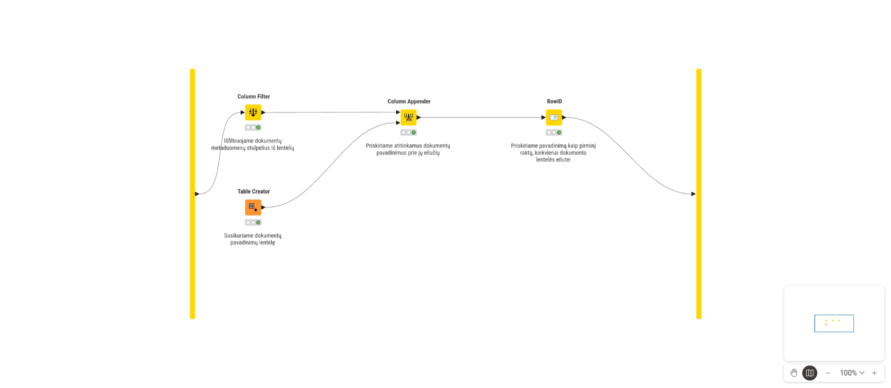
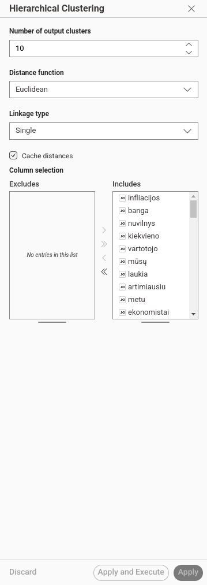
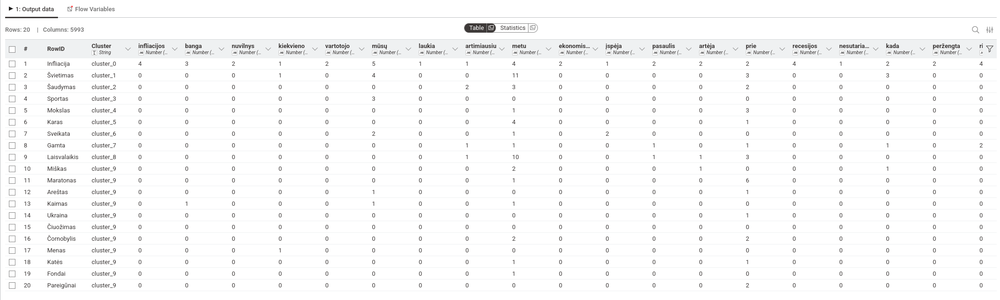
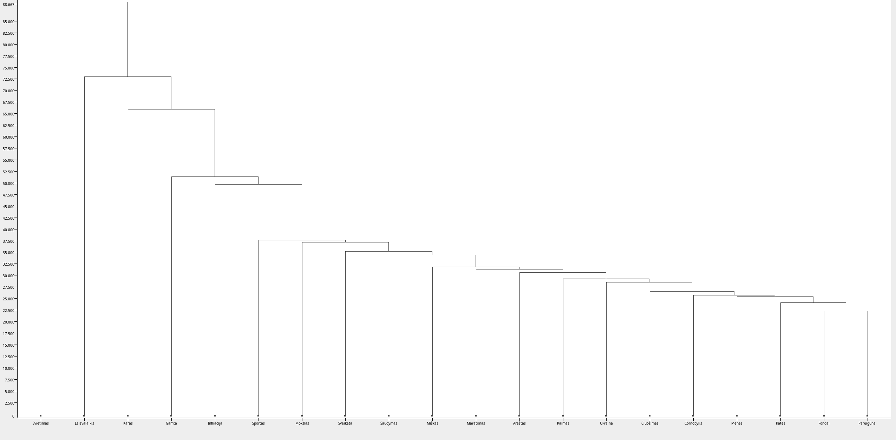
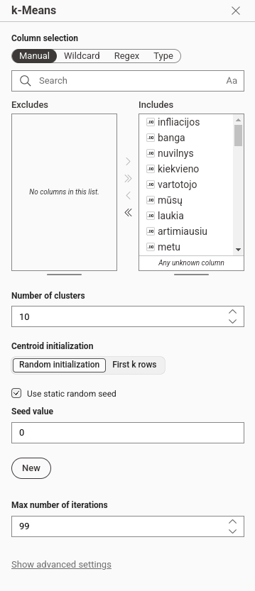
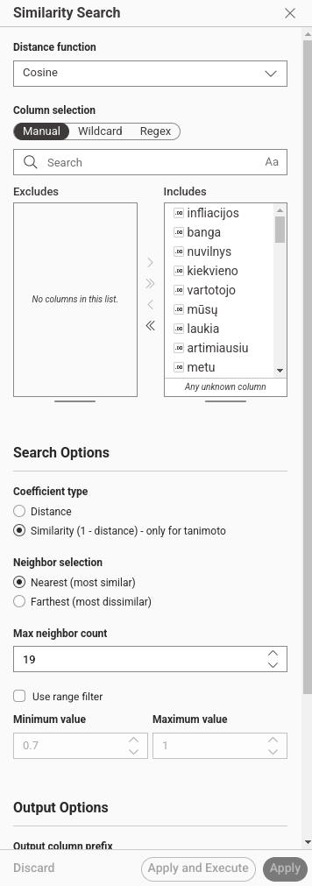
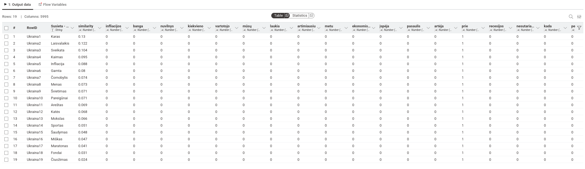

# KNIME teksto analizė
Namų darbo nr. 5 

## Duomenų filtravimas

## Duomenų normalizavimas

## Hierarchinis klasteriavimas

## Klasteriavimas remiantis „k-means“ metodu
Analizės metu atlikta tekstinio panašumo analizė su kitais esančiais dokumentais [/documents](/documents) direktorijoje.
## Parametrai
- Klasteriavimui buvo pasirinktas klasterių kiekis `D / 2`, kur `D` yra dokumentų kiekis [/documents](documents) direktorijoje.

## Rezultatai
Iš gautų rezultatų įžvelgta, kad `cluster_6` klasteris buvo vienas didžiausias sugeneruotas klasterių siejantis šiuos failus:
1. [7-fondai.txt](documents/7-fondai.txt)
1. [8-maratonas.txt](documents/8-maratonas.txt)
1. [9-mokslas.txt](documents/9-mokslas.txt)
1. [10-ukraina.txt](documents/10-ukraina.txt)
1. [11-pareigunai.txt](documents/11-pareigunai.txt)
1. [13-karas.txt](documents/13-karas.txt)
1. [14-cornobylis.txt](documents/14-cornobylis.txt)
1. [15-kates.txt](documents/15-kates.txt)
1. [17-menas.txt](documents/17-menas.txt)
1. [18-kaimas.txt](documents/18-kaimas.txt)
1. [20-laisvalaikis.txt](documents/20-laisvalaikis.txt)

## Teksto panašumo paieška
Analizės metu atlikta [1-ukraina.txt](documents/10-ukraina.txt) tekstinio failo panašumo analizė su kitais esančiais dokumentais [/documents](/documents) direktorijoje.
## Parametrai
- Paieškai buvo pasirinktas panašumo koeficientas leidžiantis santykinai nustatyti sąryšį tarp dokumentų turinio.
- Buvo pasirinktas maksimalus kaimynų limitas `D - 1`, kur `D` yra dokumentų kiekis [/documents](documents) direktorijoje.

## Rezultatai
Iš gautų rezultatų įžvelgta, kad [10-ukraina.txt](documents/10-ukraina.txt) tekstinio failo turinys yra labiausiai susijęs su šiais failais:
1. [13-karas.txt](documents/13-karas.txt)
1. [20-laisvalaikis.txt](documents/20-laisvalaikis.txt)
1. [16-sveikata.txt](documents/16-sveikata.txt)
1. [18-kaimas.txt](documents/18-kaimas.txt)
1. [1-infliacija.txt](documents/1-infliacija.txt)
1. [16-gamta.txt](documents/16-sveikata.txt)
1. [14-cornobylis.txt](documents/14-cornobylis.txt)

Atsižvelgus į rezultatus, įžvelgiama, kad šis rezultatas sutampa su paskiausiais [hierachinio](#hierarchinis-klasteriavimas) bei [„k-means“](#klasteriavimas-remiantis-k-means-metodu) klasterizavimo rezultatais. Šių dienų realijos įrodo kad paieškos algoritmas tinkamai sieja dokumentus tarpusavyje.

